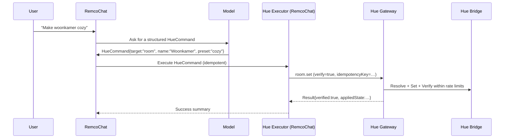

# Change Request — Hue Gateway API (for RemcoChat “first-time-right” Hue control)

Status: **Draft**  
Audience: **Hue Gateway API team** + RemcoChat maintainers  
Date: **2026-02-04**  
Prepared by: **RemcoChat team**

## 0) Executive summary

RemcoChat’s `hue-instant-control` skill currently achieves good results, but reliability is constrained by:

- **Too many round-trips** per user command (resolve → fetch → set → verify) and repeated parsing of CLIP v2 data.
- **Inconsistent error envelopes** (401 differs) + under-specified OpenAPI error responses.
- **Name resolution that is hard to make “first-time-right”** without extra client-side safeguards (confidence thresholds, disambiguation rules, “never guess” UX).
- **No built-in end-to-end verification contract** for state changes (clients implement their own verify + timing tolerances).
- **SSE events are not resumable** (no event `id`/cursor); payloads are too minimal to reduce polling.
- **429 rate limiting is not actionable** (no `Retry-After` or structured retry guidance).

We recommend making the Hue Gateway **more “command-oriented”** for the common operations RemcoChat needs (room/zone control + inventory listing), with **safe target resolution**, **idempotency**, **verification**, and **resumable SSE**. This will allow RemcoChat to remove most of the bash/curl orchestration and provide “full first-time-right” lighting control with clear failure semantics.

## 1) Goals / non-goals

### Goals

1. **First-time-right Hue control**: correct target, correct state, verified, with clear user feedback.
2. **Fail-safe end-to-end architecture**: resilient to transient gateway/bridge/network issues, rate limits, and eventual consistency.
3. **Simplify `hue-instant-control`**: fewer scripted round-trips; less JSON parsing; fewer tool failures.
4. **Additive API evolution**: do not break existing clients; new capabilities are opt-in.

### Non-goals

- Remote/cloud access, multi-tenant auth, or internet exposure of Hue Gateway.
- Replacing Hue CLIP v2; the gateway should continue to support `clipv2.request` as a “power tool”.

## 2) Current state (observed)

### 2.1 Architecture today

```mermaid
flowchart LR
  U["User"] -->|NL request| RC["RemcoChat UI + Server"]
  RC -->|LLM tool-calling| LLM["Model"]
  LLM -->|bash tool: curl| SB["Sandbox (bash)"]
  SB -->|HTTP| HG["Hue Gateway API"]
  HG -->|HTTPS (Hue CLIP v2)| HB["Hue Bridge"]
```

### 2.2 Hue Gateway API surface (today)

From live OpenAPI (`GET /openapi.json`) the primary integration point is:

- `POST /v1/actions` (single action envelope)
- `GET /healthz`
- `GET /readyz`
- `GET /v1/events/stream` (SSE)

Actions currently include:

- `bridge.set_host`, `bridge.pair`
- `clipv2.request`
- `resolve.by_name`
- `light.set`, `grouped_light.set`, `scene.activate`

### 2.3 Typical “room set” from the skill (today)

Current implementation (see `./.skills/hue-instant-control/scripts/room_set_by_name.sh`) performs:

1. `/healthz` + `/readyz`
2. `resolve.by_name (rtype=room)`
3. `clipv2.request GET /clip/v2/resource/room/<rid>` (extract grouped_light RID)
4. `grouped_light.set (rid=grouped_light_rid, desired state)`
5. (optional) `clipv2.request GET /clip/v2/resource/grouped_light/<rid>` (verify)

This is robust but **multi-step and failure-prone** (network, parsing, rate limits, timing).

### 2.4 SSE stream (today)

`GET /v1/events/stream` emits comment keepalives and `data: <json>` frames. Example shape observed:

```json
{
  "ts": "2026-02-04T17:17:48Z",
  "source": "hue-bridge",
  "type": "resource.updated",
  "resource": { "rid": "<rid>", "rtype": "light|grouped_light" },
  "data": {}
}
```

Notable gaps for reliable consumers:

- No SSE `id:` field → no `Last-Event-ID` resume cursor.
- Payload is too minimal to avoid follow-up polling (often `data: {}`).

## 3) Key shortcomings (root causes)

### 3.1 Reliability / correctness risks

1. **Target resolution safety**  
   `resolve.by_name` and name-based actions can return low-confidence candidates. Without explicit gateway-side thresholds and “gap” rules, clients must implement safety logic to avoid mis-targeting.

2. **No “verify contract” for state-changing operations**  
   Clients currently implement verification (read-after-write) with loose tolerances and no standardized timing/backoff. This is brittle under Hue Bridge eventual consistency and aggregated resources (e.g., `grouped_light`).

3. **Too many network hops & round-trips**  
   More calls → more timeouts → more 429s → more partial failures.

4. **Rate limiting lacks actionable guidance**  
   Hue Bridge constraints are strict (notably group commands). Hue guidance (as of 2026) is **~10 commands/sec for lights** and **~1 command/sec for groups**; the gateway should help clients stay within these limits by providing retry guidance and ideally scheduling/queuing.

5. **SSE is not resumable and not stateful enough**  
   Consumers cannot safely maintain a cache or verify convergence without a cursor and richer payload or revision mechanism.

### 3.2 API usability / maintainability

1. **Inconsistent error envelopes**  
   `401` currently uses `{ "detail": { "error": "unauthorized" } }` while action failures use `{ ok:false, error:{code,message,details} }`.

2. **OpenAPI under-specifies error responses for `/v1/actions`**  
   Several non-200 responses have descriptions only; no schema in the spec. This blocks strong typed client generation and robust error handling.

3. **Missing “common read models”**  
   The skill’s scripts re-derive read models (rooms → grouped_light rid, room→lamp list, zone→light list) from raw CLIP v2 resources. This logic belongs closer to the bridge/gateway.

## 4) Proposed end-to-end architecture (fail-safe)

Principle: **LLM interprets intent; software executes deterministically.**



Key properties:

- **Idempotency**: retries are safe (at-least-once transport; exactly-once via idempotency).
- **Single-call common operations**: reduce round-trips and parsing complexity.
- **Verification**: standard “set → converge → report” behavior, with bounded latency and clear failure modes.
- **Resumable events**: enable caching and convergence confirmation without excessive polling.

## 5) Change requests for Hue Gateway API team (prioritized)

### P0 — Safety & correctness primitives (must-have)

#### P0.1 Add explicit name-matching controls and safe defaults

Problem: clients cannot guarantee “never guess” behavior without knowing gateway matching rules.

Request:

- Add optional args to `resolve.by_name` **and** all name-accepting set/activate actions:
  - `match.mode`: `exact|case_insensitive|normalized|fuzzy`
  - `match.minConfidence`: number (default recommended: **0.85** for state-changing actions)
  - `match.minGap`: number; require top match to exceed runner-up by this margin (default recommended: **0.10–0.20**)
  - `match.maxCandidates`: number (default 5–10)
- Add new error code `no_confident_match` (404 or 409) that includes top candidates + confidences.
- Ensure state-changing actions **never** auto-select a low-confidence single match.

Acceptance criteria:

- Given an unrelated string, state-changing actions return `no_confident_match` (or `ambiguous_name`) and do not actuate.
- OpenAPI fully documents match args and error payloads.

#### P0.2 Add idempotency (idempotency key → replay-safe response)

Problem: RemcoChat/tool loops may retry on timeouts; safe retries require idempotency semantics.

Request:

- Support an idempotency key for **state-changing actions** (at minimum: `light.set`, `grouped_light.set`, scene activation, and all new actions).
  - Option A: adopt `Idempotency-Key` header.
  - Option B: treat `requestId` as idempotency key when present.
  - Option C (best): accept both; define precedence.
- Store and replay responses for a TTL (e.g., 5–30 minutes) keyed by `(credential, idempotencyKey, action)`.
- Return the original response for duplicates and do not re-actuate.

Acceptance criteria:

- Two identical requests with same idempotency key produce one bridge actuation and identical responses.

#### P0.3 Standardize “set + verify” semantics (bounded, deterministic)

Problem: clients implement their own verify logic; it is brittle (timing, drift, grouped lights).

Request:

- Add a `verify` option to state-changing actions (and especially the new `room.set` / `zone.set`):
  - `verify.mode`: `none|poll|sse|poll_then_sse`
  - `verify.timeoutMs` (default 1500–2500ms)
  - `verify.pollIntervalMs` (default 150ms)
  - `verify.tolerances`: per-field (brightness, colorTempK) and defaults documented.
- Response includes:
  - `requested`: what client asked
  - `applied`: what gateway sent to bridge (after clamping)
  - `observed`: what verification observed (if verify enabled)
  - `verified`: boolean
  - `warnings`: list (e.g., clamped values, partial device unreachable)

Acceptance criteria:

- When bridge applies changes with delay, gateway verify retries until timeout.
- If verified=false, response includes actionable details (what mismatched and last observed state).

#### P0.4 Normalize error envelopes and document them in OpenAPI

Problem: typed clients and automation cannot rely on response shapes.

Request:

- Ensure *all* non-2xx responses from `/v1/actions` return a consistent envelope, ideally:
  - `{ requestId, action, ok:false, error:{ code, message, details } }`
- Keep FastAPI `{detail:…}` only for truly non-API routes, or add a compatibility mode.
- Update OpenAPI responses for 400/409/424/500/502 to include explicit schemas.

Acceptance criteria:

- A generated client can parse and branch on `error.code` for every failure path.

#### P0.5 Make 429 actionable (Retry-After + body fields)

Request:

- Add `Retry-After` header (seconds) and/or body fields:
  - `retryAfterMs`
  - `limit` / `remaining` / `resetMs` (if applicable)
- Consider an internal queue with bounded depth:
  - If queue has capacity, return 202/200 with `queued=true` + eventual verification.
  - If queue is full, return 429 with retry guidance.
  - Ensure the gateway’s limiting aligns with Hue guidance (notably **~10 cmds/sec lights** and **~1 cmd/sec groups**) so clients don’t need bridge-specific rate-limit knowledge.

Acceptance criteria:

- Clients can implement a single, correct backoff strategy without guessing.

### P0 — High-level actions to collapse multi-step flows (must-have)

These remove most of the bash scripts and reduce failures.

#### P0.6 Add `room.set` action (name/rid → grouped_light set + verify)

New action:

- `room.set`
  - inputs: `roomRid | roomName`, desired state, match controls, verify controls, idempotency key
  - behavior: resolve room → extract grouped_light rid → set grouped_light → verify

Response should include `roomRid`, `groupedLightRid`, and verification outcome.

Example request:

```json
{
  "requestId": "chat-2026-02-04T17:20:00Z-0001",
  "action": "room.set",
  "args": {
    "roomName": "Woonkamer",
    "state": { "on": true, "brightness": 35, "colorTempK": 2400 },
    "match": { "mode": "normalized", "minConfidence": 0.85, "minGap": 0.15 },
    "verify": { "mode": "poll", "timeoutMs": 2000, "pollIntervalMs": 150 }
  }
}
```

Example success response (shape):

```json
{
  "requestId": "chat-2026-02-04T17:20:00Z-0001",
  "action": "room.set",
  "ok": true,
  "result": {
    "roomRid": "<room_rid>",
    "groupedLightRid": "<grouped_light_rid>",
    "requested": { "on": true, "brightness": 35, "colorTempK": 2400 },
    "applied": { "on": true, "brightness": 35, "colorTempK": 2400 },
    "observed": { "on": true, "brightness": 36, "colorTempK": 2390 },
    "verified": true,
    "warnings": []
  }
}
```

#### P0.7 Add `zone.set` action (name/rid → grouped_light set + verify + “impact” metadata)

In addition to `zoneRid` and `groupedLightRid`, return impact metadata:

- `affectedRooms`: count + optional names/rids
- `affectedLights`: count (best-effort)

This allows RemcoChat to ask for confirmation without expensive read flows.

Example `dryRun` request (no actuation; only impact):

```json
{
  "requestId": "chat-2026-02-04T17:21:00Z-0001",
  "action": "zone.set",
  "args": {
    "zoneName": "Beneden",
    "state": { "on": false },
    "dryRun": true,
    "match": { "mode": "normalized", "minConfidence": 0.85, "minGap": 0.15 }
  }
}
```

Example `dryRun` response (shape):

```json
{
  "requestId": "chat-2026-02-04T17:21:00Z-0001",
  "action": "zone.set",
  "ok": true,
  "result": {
    "zoneRid": "<zone_rid>",
    "groupedLightRid": "<grouped_light_rid>",
    "impact": {
      "affectedRooms": [{ "rid": "<room_rid>", "name": "Woonkamer" }],
      "affectedLightsCount": 12
    },
    "dryRun": true
  }
}
```

#### P0.8 Add inventory read models for “list lamps/lights”

At least one of:

- `room.list_lamps` → list device names (only those exposing `light` service), optionally include rids
- `zone.list_lights` → list light names + room mapping (best-effort)
- OR a general `inventory.snapshot` (see P1.3)

### P1 — SSE: resumable, useful, and cache-friendly (should-have)

#### P1.1 Add SSE cursors (`id:`) + resume support

Request:

- Emit an SSE `id:` per event (monotonic or time+seq).
- On reconnect, accept `Last-Event-ID` and replay missed events from a short buffer (e.g., last 1–5 minutes), or return a `needs_resync` event.
- Emit `event:` fields (optional) so consumers can route without parsing JSON.

Example event frame (illustrative):

```text
id: 1042-17
event: resource.updated
data: {"ts":"2026-02-04T17:17:48Z","resource":{"rid":"<rid>","rtype":"light"},"data":{"on":{"on":true}}}
```

#### P1.2 Make SSE payloads more useful (or add a revision-based model)

Options (either is acceptable):

- Include a **delta** (changed fields) in `data`, or
- Include a `revision` for the resource and a separate endpoint to fetch changes since revision.

Goal: consumers can validate convergence without polling entire inventories.

### P1 — Inventory caching / batching (should-have)

#### P1.3 Add `inventory.snapshot` (normalized, stable read model)

Problem: clients repeatedly fetch multiple CLIP v2 resource lists to build a usable model.

Request:

- Provide a single normalized snapshot containing:
  - rooms: `{ rid, name, groupedLightRid }`
  - zones: `{ rid, name, groupedLightRid, roomRids? }`
  - lights: `{ rid, name, ownerDeviceRid, roomRid? }`
  - scenes: `{ rid, name, groupRid? }` (optional)
  - plus metadata: `generatedAt`, `bridgeId`, `revision`, `stale` flag
- Support ETag/If-None-Match to reduce bandwidth.

Example response (shape):

```json
{
  "requestId": "chat-2026-02-04T17:22:00Z-0001",
  "action": "inventory.snapshot",
  "ok": true,
  "result": {
    "bridgeId": "<bridge_id>",
    "generatedAt": "2026-02-04T17:22:00Z",
    "revision": 1042,
    "stale": false,
    "rooms": [{ "rid": "<room_rid>", "name": "Woonkamer", "groupedLightRid": "<gl_rid>" }],
    "zones": [{ "rid": "<zone_rid>", "name": "Beneden", "groupedLightRid": "<gl_rid>", "roomRids": ["<room_rid>"] }],
    "lights": [{ "rid": "<light_rid>", "name": "Staande lamp", "ownerDeviceRid": "<device_rid>", "roomRid": "<room_rid>" }]
  }
}
```

#### P1.4 Add `actions.batch` (sequential + typed + correlated)

Request:

- Allow `POST /v1/actions` to accept `action:"actions.batch"` with `args:{ actions:[…] }`, executed sequentially with:
  - per-step status
  - shared idempotency key (or per-step keys)
  - shared verification strategy (optional)

This reduces latency and failure surface for multi-read flows (resolve + fetch + set + verify).

### P2 — Operational quality-of-life (nice-to-have)

- `bridge.discover` (mDNS/SSDP) to find the bridge and set host.
- `bridge.refresh_inventory` to force reindexing (used after renames/new devices).
- Structured metrics endpoint (Prometheus) and trace propagation (`traceparent`).

## 6) Changes we will implement in RemcoChat (to leverage the above)

### 6.1 Move execution out of bash/curl where possible

- Implement a typed `HueGatewayClient` in RemcoChat server generated from Hue Gateway OpenAPI.
- Add a dedicated tool (e.g., `hueGateway`) that accepts a **validated** command schema instead of raw shell.
- Keep bash scripts as fallback for local debugging, but not as the primary control plane.

### 6.2 Plan/confirm/execute UX for “wide impact” actions

- For zone/all-house requests: call `zone.set` with `dryRun=true` (or use impact metadata), ask user to confirm, then execute with an idempotency key bound to that plan.

### 6.3 Local cache + SSE subscriber

- Subscribe to gateway SSE and maintain:
  - inventory cache (rooms/zones/lights)
  - last-known state for recently controlled resources
- Use the cache to:
  - reduce discovery calls
  - detect ambiguous names and ask better questions
  - confirm convergence faster

### 6.4 Tool-loop retry discipline

- Cap retries for Hue commands (especially after partial success) and rely on idempotency keys.
- Prefer “fail fast + explain” over repeated actuation attempts.

## 7) Skills system improvements (non-breaking)

These are optional but improve ergonomics without changing the skill file standard in a breaking way:

1. **Connection hints on activation**  
   Extend `skillsActivate` output with optional `connectionHints` (e.g., `HUE_GATEWAY_BASE_URL`, auth header key name) so skills don’t need to guess host vs sandbox routing.

2. **Standardized env injection for sandbox tools**  
   Allow the server to inject whitelisted env vars into the bash sandbox (e.g., `BASE_URL`, `HUE_AUTH_HEADER`) based on server config.

3. **“Structured tool first” guidance**  
   Update the `hue-instant-control` skill to prefer `hueGateway` tool calls (once available) and use bash scripts only when the tool is disabled.

## 8) Acceptance criteria (end-to-end)

We consider the system “first-time-right” when the following holds:

1. **Correct targeting**
   - No state-changing command executes on a low-confidence match.
   - Ambiguity always results in a follow-up question or a candidate list.

2. **Correct actuation**
   - For single-room commands, the system returns `verified=true` within 2.5s in normal conditions.
   - For wide-impact commands, the system requires explicit confirmation.

3. **Resilience**
   - Transient network errors trigger bounded retries using idempotency keys (no duplicate actuation).
   - 429 responses include actionable backoff guidance.

4. **Observability**
   - Every command has a correlation/idempotency key that appears in gateway logs and RemcoChat logs.

## 9) References (external best practices / constraints)

- Hue Bridge constraints: rate limits and guidance (notably group commands): [Hue Developer Program — Philips Hue API rate limits](https://developers.meethue.com/support/what-is-the-maximum-number-of-requests-that-can-be-sent-to-the-bridge/)
- Hue Bridge transport: HTTPS-only direction and deprecation of HTTP: [Hue Developer Program — Deprecation of HTTP support](https://developers.meethue.com/deprecation-of-http-support/)
- HTTP idempotency keys (standardization effort): [IETF draft — Idempotency-Key HTTP Header Field](https://datatracker.ietf.org/doc/draft-ietf-httpapi-idempotency-key-header/)
- HTTP semantics (idempotency, retries): [RFC 9110 — HTTP Semantics](https://www.rfc-editor.org/rfc/rfc9110)
- SSE format + reconnect/resume concepts: [MDN — Using server-sent events](https://developer.mozilla.org/en-US/docs/Web/API/Server-sent_events/Using_server-sent_events)
- Practical idempotent request patterns: [Stripe — Idempotent requests](https://stripe.com/docs/idempotency)
- Retries/backoff guidance (jitter, thundering herd avoidance): [AWS Architecture Blog — Exponential Backoff and Jitter](https://aws.amazon.com/blogs/architecture/exponential-backoff-and-jitter/)
