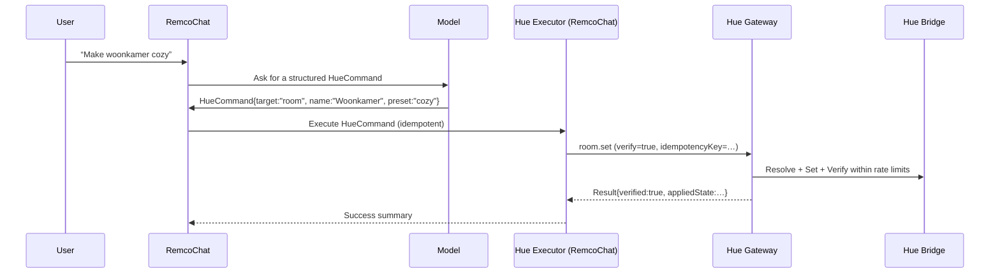

# Change Request — Hue Gateway API v2 (architecture → 2.0 spec scaffolding)

Status: **Draft**  
Version: **0v91**  
Audience: **Hue Gateway API team** + RemcoChat maintainers  
Date: **2026-02-04**  
Prepared by: **RemcoChat team**  
Revised by: **Codex** (repo + OpenAPI review)

## 0v91 change log (from 0v9)

This revision is based on a review of the current gateway implementation and OpenAPI in this repo:

- Added a “current implementation snapshot” section grounded in `src/hue_gateway/*` + `openapi.json`.
- Clarified a **v2 versioning / compatibility** approach (keep `/v1/*` stable; introduce `/v2/*` for the 2.0 spec).
- Tightened several items into more spec-ready requirements (error model, correlation, idempotency, verify, SSE cursors).
- Restructured priority headings to avoid duplicate `P0`/`P1` labels and make a future v2 backlog easier to track.
- Incorporated RemcoChat review confirmations: default verify tolerances, SSE event cursor + inventory revision semantics, and an explicit v2 `error.code` registry.

## 0) Executive summary

RemcoChat’s `hue-instant-control` skill currently achieves good results, but reliability is constrained by:

- **Too many round-trips** per user command (resolve → fetch → set → verify) and repeated parsing of CLIP v2 data.
- **Inconsistent error envelopes** (401 differs) + under-specified OpenAPI error responses.
- **Name resolution that is hard to make “first-time-right”** without extra client-side safeguards (confidence thresholds, disambiguation rules, “never guess” UX).
- **No built-in end-to-end verification contract** for state changes (clients implement their own verify + timing tolerances).
- **SSE events are not resumable** (no event `id`/cursor); payloads are too minimal to reduce polling.
- **429 rate limiting is not actionable** (no `Retry-After` or structured retry guidance).

We recommend making the Hue Gateway **more “command-oriented”** for the common operations RemcoChat needs (room/zone control + inventory listing), with **safe target resolution**, **idempotency**, **verification**, and **resumable SSE**. This will allow RemcoChat to remove most of the bash/curl orchestration and provide “full first-time-right” lighting control with clear failure semantics.

## 0.1) Reviewer notes (Codex)

### What’s strong

- The document keeps the LLM focused on **intent → structured command**, while insisting all actuation is software-deterministic.
- It targets the real reliability killers: extra round-trips, ambiguous targeting, missing verification, non-resumable/minimal SSE, and unactionable 429s.
- It proposes the right “collapse points” (`room.set`, `zone.set`, normalized inventory) that align with real user intent and eliminate client-side CLIP parsing.

### What needs tightening to become a v2.0 spec

- Define a **v2 versioning** story (this revision recommends `/v2/*`) and lock the base envelopes + error registry.
- Separate **correlation** from **idempotency** (do not reuse `requestId` for replay safety); define precedence across headers/body.
- Specify **verification** precisely (tolerances, clamping, partial success, time bounds) so it is testable and consistent across resource types.
- Choose one **events + inventory coherence** model (cursor-replay or revision-based) and specify it end-to-end.
- Make rate limits and retries a **contract** (headers + body hints), not client folklore.
- Leverage what already exists: this repo already has **SQLite resources**, **name_index**, and **bridge SSE ingestion**, so v2 features like `inventory.snapshot`, richer SSE frames, and cache-backed verify are implementable without a rewrite.

## 1) Goals / non-goals

### Goals

1. **First-time-right Hue control**: correct target, correct state, verified, with clear user feedback.
2. **Fail-safe end-to-end architecture**: resilient to transient gateway/bridge/network issues, rate limits, and eventual consistency.
3. **Simplify `hue-instant-control`**: fewer scripted round-trips; less JSON parsing; fewer tool failures.
4. **Safe evolution path to v2**: keep `/v1/*` stable; define `/v2/*` as the 2.0 spec and migrate clients intentionally.

### Non-goals

- Remote/cloud access, multi-tenant auth, or internet exposure of Hue Gateway.
- Replacing Hue CLIP v2; the gateway should continue to support `clipv2.request` as a “power tool”.

## 2) Current state (observed + repo reality)

### 2.1 Architecture today

```mermaid
flowchart LR
  U["User"] -->|NL request| RC["RemcoChat UI + Server"]
  RC -->|LLM tool-calling| LLM["Model"]
  LLM -->|bash tool: curl| SB["Sandbox (bash)"]
  SB -->|HTTP| HG["Hue Gateway API"]
  HG -->|HTTPS (Hue CLIP v2)| HB["Hue Bridge"]
```

### 2.2 Gateway implementation snapshot (as of 2026-02-04)

Notes based on the current codebase and generated OpenAPI in this repository:

- **Runtime**: FastAPI app with background tasks started via `lifespan` (see `src/hue_gateway/app.py`).
- **Persistence**: SQLite with `settings`, `resources`, and `name_index` tables (see `src/hue_gateway/db.py`).
- **Cache**: in-memory `ResourceCache` plus periodic full resync (see `src/hue_gateway/hue_sync.py`).
- **Bridge SSE ingestion**: gateway connects to Hue Bridge `/eventstream/clip/v2` and:
  - persists updated resources (by fetching full resources per event)
  - publishes normalized events via an in-memory `EventHub` (see `src/hue_gateway/hue_sync.py`, `src/hue_gateway/event_hub.py`)
- **API**: `POST /v1/actions` is a discriminated union (`oneOf` + `action` discriminator) in OpenAPI; actions currently implemented: `bridge.set_host`, `bridge.pair`, `clipv2.request`, `resolve.by_name`, `light.set`, `grouped_light.set`, `scene.activate` (see `openapi.json`, `src/hue_gateway/schemas.py`, `src/hue_gateway/actions.py`).
- **Auth**: Bearer token or `X-API-Key` enforced on `/v1/*` (see `src/hue_gateway/security.py`).
- **Rate limiting**: per-credential token bucket with `429 { "error":"rate_limited" }` (see `src/hue_gateway/rate_limit.py`).
- **Known contract inconsistencies** (relevant for v2):
  - `401` uses FastAPI `{ "detail": { "error":"unauthorized" } }` while action failures use `{ ok:false, error:{code,message,details} }`.
  - `429` is not an action envelope and provides no retry hints.
  - SSE events have no `id` cursor and currently emit minimal payloads (`data: {}` in many cases).

### 2.3 Hue Gateway API surface (today)

From live OpenAPI (`GET /openapi.json`) the primary integration point is:

- `POST /v1/actions` (single action envelope)
- `GET /healthz`
- `GET /readyz`
- `GET /v1/events/stream` (SSE)

Actions currently include:

- `bridge.set_host`, `bridge.pair`
- `clipv2.request`
- `resolve.by_name`
- `light.set`, `grouped_light.set`, `scene.activate`

### 2.4 Typical “room set” from the skill (today)

Current implementation (see `./.skills/hue-instant-control/scripts/room_set_by_name.sh`) performs:

1. `/healthz` + `/readyz`
2. `resolve.by_name (rtype=room)`
3. `clipv2.request GET /clip/v2/resource/room/<rid>` (extract grouped_light RID)
4. `grouped_light.set (rid=grouped_light_rid, desired state)`
5. (optional) `clipv2.request GET /clip/v2/resource/grouped_light/<rid>` (verify)

This is robust but **multi-step and failure-prone** (network, parsing, rate limits, timing).

### 2.5 SSE stream (today)

`GET /v1/events/stream` emits comment keepalives and `data: <json>` frames. Example shape observed:

```json
{
  "ts": "2026-02-04T17:17:48Z",
  "source": "hue-bridge",
  "type": "resource.updated",
  "resource": { "rid": "<rid>", "rtype": "light|grouped_light" },
  "data": {}
}
```

Notable gaps for reliable consumers:

- No SSE `id:` field → no `Last-Event-ID` resume cursor.
- Payload is too minimal to avoid follow-up polling (often `data: {}`).

## 3) Key shortcomings (root causes)

### 3.1 Reliability / correctness risks

1. **Target resolution safety**  
   `resolve.by_name` and name-based actions can return low-confidence candidates. Without explicit gateway-side thresholds and “gap” rules, clients must implement safety logic to avoid mis-targeting.

2. **No “verify contract” for state-changing operations**  
   Clients currently implement verification (read-after-write) with loose tolerances and no standardized timing/backoff. This is brittle under Hue Bridge eventual consistency and aggregated resources (e.g., `grouped_light`).

3. **Too many network hops & round-trips**  
   More calls → more timeouts → more 429s → more partial failures.

4. **Rate limiting lacks actionable guidance**  
   Hue Bridge constraints are strict (notably group commands). Hue guidance (as of 2026) is **~10 commands/sec for lights** and **~1 command/sec for groups**; the gateway should help clients stay within these limits by providing retry guidance and ideally scheduling/queuing.

5. **SSE is not resumable and not stateful enough**  
   Consumers cannot safely maintain a cache or verify convergence without a cursor and richer payload or revision mechanism.

### 3.2 API usability / maintainability

1. **Inconsistent error envelopes**  
   `401` currently uses `{ "detail": { "error": "unauthorized" } }` while action failures use `{ ok:false, error:{code,message,details} }`.

2. **OpenAPI under-specifies error responses for `/v1/actions`**  
   Several non-200 responses have descriptions only; no schema in the spec. This blocks strong typed client generation and robust error handling.

3. **Missing “common read models”**  
   The skill’s scripts re-derive read models (rooms → grouped_light rid, room→lamp list, zone→light list) from raw CLIP v2 resources. This logic belongs closer to the bridge/gateway.

### 3.3 Gaps to close before this can become a v2.0 spec

The change requests below are directionally correct, but a v2.0 spec needs a few additional “spec primitives” to be explicit and testable:

1. **Versioning and compatibility**  
   Decide whether v2 is delivered via new endpoints (`/v2/*`) or by evolving `/v1/*` in-place. This document recommends **`/v2/*`** for the 2.0 spec, keeping `/v1/*` stable for existing generated clients.

2. **Correlation vs idempotency (do not conflate)**  
   Today the gateway has both a body `requestId` and ad-hoc use of `X-Request-Id` in logs/validation. v2 should clearly define:
   - correlation identifier (for logging/tracing)
   - idempotency key (for replay-safe retries)
   - precedence rules when both headers + body fields are present

3. **Canonical error model**  
   v2 should publish:
   - one error envelope for *all* error statuses (including `401` and `429`)
   - a registry of `error.code` values and which HTTP status each maps to
   - OpenAPI schemas for every non-2xx response the client is expected to handle

4. **Verification contract**  
   Define precisely what “verified” means (fields, tolerances, time bounds), including device capability clamping and eventual consistency.

5. **Events + inventory coherence model**  
   Lock the coherence mechanism and specify it fully:
   - SSE event cursor (`id:`) with replay buffer for resume, and
   - a separate inventory `revision` included in SSE payloads + `inventory.snapshot` (so clients can refresh inventory only when it changes).

6. **Rate limiting contract**  
   Specify:
   - what clients should do on `429` (headers + body fields, backoff)
   - whether the gateway queues/batches work (and how it reports queued vs applied)
   - any action “cost model” that protects bridge group limits without forcing clients to learn them.

## 4) Proposed end-to-end architecture (fail-safe)

Principle: **LLM interprets intent; software executes deterministically.**



Key properties:

- **Idempotency**: retries are safe (at-least-once transport; exactly-once via idempotency).
- **Single-call common operations**: reduce round-trips and parsing complexity.
- **Verification**: standard “set → converge → report” behavior, with bounded latency and clear failure modes.
- **Resumable events**: enable caching and convergence confirmation without excessive polling.

## 5) Change requests for Hue Gateway API team (prioritized)

Unless explicitly stated otherwise, treat the items below as **v2.0 spec requirements**. Recommended delivery:

- Keep existing `/v1/*` behavior stable for generated-client compatibility.
- Implement the v2.0 spec on new endpoints (`/v2/actions`, `/v2/events/stream`) with the tightened contracts described here.
- Only backport to `/v1/*` when it is provably non-breaking (e.g., docs/OpenAPI improvements, additive fields).

### P0a — Safety & correctness primitives (must-have)

#### P0.1 Add explicit name-matching controls and safe defaults

Problem: clients cannot guarantee “never guess” behavior without knowing gateway matching rules.

Request:

- Add optional args to `resolve.by_name` **and** all name-accepting set/activate actions:
  - `match.mode`: `exact|case_insensitive|normalized|fuzzy`
  - `match.minConfidence`: number (default recommended: **0.85** for state-changing actions)
  - `match.minGap`: number; require top match to exceed runner-up by this margin (default recommended: **0.10–0.20**)
  - `match.maxCandidates`: number (default 5–10)
- Add new error code `no_confident_match` (404 or 409) that includes top candidates + confidences.
- Ensure state-changing actions **never** auto-select a low-confidence single match.

Acceptance criteria:

- Given an unrelated string, state-changing actions return `no_confident_match` (or `ambiguous_name`) and do not actuate.
- OpenAPI fully documents match args and error payloads.

#### P0.2 Add idempotency (idempotency key → replay-safe response)

Problem: RemcoChat/tool loops may retry on timeouts; safe retries require idempotency semantics.

Request:

- Support an idempotency key for **state-changing actions** (at minimum: `light.set`, `grouped_light.set`, scene activation, and all new actions).
  - Option A (recommended): adopt `Idempotency-Key` header.
  - Option B: allow a top-level `idempotencyKey` field for clients that cannot set headers.
  - Option C (best): accept both; **header wins**; if both are present and differ, return `400 invalid_idempotency_key`.
  - `requestId` remains a **correlation id** and MUST NOT be treated as an idempotency key.
- Store and replay responses for a TTL (e.g., 5–30 minutes) keyed by `(credential, idempotencyKey, action)`.
- Return the original response for duplicates and do not re-actuate.
- If an idempotency key is currently executing, return `409 idempotency_in_progress` with retry guidance (`Retry-After` and/or `retryAfterMs`).

Acceptance criteria:

- Two identical requests with same idempotency key produce one bridge actuation and identical responses.

#### P0.3 Standardize “set + verify” semantics (bounded, deterministic)

Problem: clients implement their own verify logic; it is brittle (timing, drift, grouped lights).

Request:

- Add a `verify` option to state-changing actions (and especially the new `room.set` / `zone.set`):
  - `verify.mode`: `none|poll|sse|poll_then_sse`
  - `verify.timeoutMs` (default 1500–2500ms)
  - `verify.pollIntervalMs` (default 150ms)
  - `verify.tolerances`: per-field overrides; defaults MUST be documented and testable.
- Default tolerances (recommended to lock for v2.0):
  - `on`: exact match
  - `brightness`:
    - `light.*`: ±5
    - `grouped_light` / `room.set` / `zone.set`: ±25 (aggregation drift)
  - `colorTempK`:
    - `light.*`: ±200K
    - `grouped_light` / `room.set` / `zone.set`: ±800K
  - `xy`: either (a) best-effort verify with a wide tolerance, or (b) verify off by default unless explicitly requested (recommended: **off by default**).
- Response includes:
  - `requested`: what client asked
  - `applied`: what gateway sent to bridge (after clamping)
  - `observed`: what verification observed (if verify enabled)
  - `verified`: boolean
  - `warnings`: list (e.g., clamped values, partial device unreachable)
- Verification compares `observed` against `applied` (not `requested`) using the configured tolerances.

Acceptance criteria:

- When bridge applies changes with delay, gateway verify retries until timeout.
- If verified=false, response includes actionable details (what mismatched and last observed state).

#### P0.4 Normalize error envelopes and document them in OpenAPI

Problem: typed clients and automation cannot rely on response shapes.

Request:

- Ensure *all* non-2xx responses from `/v2/actions` return a consistent envelope, ideally:
  - `{ requestId, action, ok:false, error:{ code, message, details } }`
- Backport to `/v1/actions` only when it is clearly non-breaking for existing clients (note: `401`/`429` body changes are likely breaking).
- Keep FastAPI `{detail:…}` only for truly non-API routes, or add a compatibility mode.
- Update OpenAPI responses for 400/409/424/500/502 to include explicit schemas.
- Publish an explicit `error.code` registry in the v2 spec mapping: `error.code → HTTP status → retryability`.

Initial v2 `error.code` registry (seed; expand as v2 grows):

| `error.code` | HTTP status | Retryable | Notes |
| --- | --- | --- | --- |
| `invalid_json` | 400 | no | Body is not valid JSON. |
| `invalid_request` | 400 | no | Schema/validation failure. |
| `invalid_action` | 400 | no | Missing/invalid `action`. |
| `unknown_action` | 400 | no | `action` not supported. |
| `invalid_args` | 400 | no | `args` is not an object or invalid for action. |
| `request_id_mismatch` | 400 | no | `X-Request-Id` and body `requestId` differ. |
| `invalid_idempotency_key` | 400 | no | Header and body idempotency keys differ. |
| `unauthorized` | 401 | no | Missing/invalid auth. (Retry only after fixing credentials.) |
| `rate_limited` | 429 | yes (after wait) | Gateway limiter; include `Retry-After` + `retryAfterMs`. |
| `bridge_rate_limited` | 429 | yes (after wait) | Upstream limiter; include retry guidance. |
| `bridge_unreachable` | 424 | yes (backoff) | Network/connectivity to bridge. |
| `bridge_error` | 502 | maybe | Retry only if safe + idempotent. |
| `link_button_not_pressed` | 409 | yes (after action) | Pairing requires physical button press. |
| `ambiguous_name` | 409 | no | Requires disambiguation; includes candidates. |
| `no_confident_match` | 409 | no | No safe match; includes candidates/thresholds. |
| `not_found` | 404 | no | Resource does not exist. |
| `idempotency_in_progress` | 409 | yes (after wait) | In-flight request for same key; include retry guidance. |
| `idempotency_key_reuse_mismatch` | 409 | no | Same key used for different request payload. |
| `internal_error` | 500 | maybe | Unexpected gateway failure. |

Acceptance criteria:

- A generated client can parse and branch on `error.code` for every failure path.

#### P0.5 Make 429 actionable (Retry-After + body fields)

Request:

- For v2.0: **reject**, do not queue (no internal work queue in the v2.0 contract).
- Add `Retry-After` header (seconds) whenever the gateway can compute it.
- Always include `retryAfterMs` in the response body.
- Keep the response in the canonical error envelope and differentiate:
  - `error.code=rate_limited` (gateway)
  - `error.code=bridge_rate_limited` (upstream)
- Optionally include `limit` / `remaining` / `resetMs` when available, but do not require clients to depend on them.
- Ensure the gateway’s limiting aligns with Hue guidance (notably **~10 cmds/sec lights** and **~1 cmd/sec groups**) so clients don’t need bridge-specific rate-limit knowledge.

Acceptance criteria:

- Clients can implement a single, correct backoff strategy without guessing.

### P0b — High-level actions to collapse multi-step flows (must-have)

These remove most of the bash scripts and reduce failures.

#### P0.6 Add `room.set` action (name/rid → grouped_light set + verify)

New action:

- `room.set`
  - inputs: `roomRid | roomName`, desired state, match controls, verify controls, idempotency key
  - behavior: resolve room → extract grouped_light rid → set grouped_light → verify

Response should include `roomRid`, `groupedLightRid`, and verification outcome.

Example request:

```json
{
  "requestId": "chat-2026-02-04T17:20:00Z-0001",
  "action": "room.set",
  "args": {
    "roomName": "Woonkamer",
    "state": { "on": true, "brightness": 35, "colorTempK": 2400 },
    "match": { "mode": "normalized", "minConfidence": 0.85, "minGap": 0.15 },
    "verify": { "mode": "poll", "timeoutMs": 2000, "pollIntervalMs": 150 }
  }
}
```

Example success response (shape):

```json
{
  "requestId": "chat-2026-02-04T17:20:00Z-0001",
  "action": "room.set",
  "ok": true,
  "result": {
    "roomRid": "<room_rid>",
    "groupedLightRid": "<grouped_light_rid>",
    "requested": { "on": true, "brightness": 35, "colorTempK": 2400 },
    "applied": { "on": true, "brightness": 35, "colorTempK": 2400 },
    "observed": { "on": true, "brightness": 36, "colorTempK": 2390 },
    "verified": true,
    "warnings": []
  }
}
```

#### P0.7 Add `zone.set` action (name/rid → grouped_light set + verify + “impact” metadata)

In addition to `zoneRid` and `groupedLightRid`, return impact metadata:

- `affectedRooms`: count + optional names/rids
- `affectedLights`: count (best-effort)

This allows RemcoChat to ask for confirmation without expensive read flows.

Example `dryRun` request (no actuation; only impact):

```json
{
  "requestId": "chat-2026-02-04T17:21:00Z-0001",
  "action": "zone.set",
  "args": {
    "zoneName": "Beneden",
    "state": { "on": false },
    "dryRun": true,
    "match": { "mode": "normalized", "minConfidence": 0.85, "minGap": 0.15 }
  }
}
```

Example `dryRun` response (shape):

```json
{
  "requestId": "chat-2026-02-04T17:21:00Z-0001",
  "action": "zone.set",
  "ok": true,
  "result": {
    "zoneRid": "<zone_rid>",
    "groupedLightRid": "<grouped_light_rid>",
    "impact": {
      "affectedRooms": [{ "rid": "<room_rid>", "name": "Woonkamer" }],
      "affectedLightsCount": 12
    },
    "dryRun": true
  }
}
```

#### P0.8 Add inventory read models for “list lamps/lights”

At least one of:

- `room.list_lamps` → list device names (only those exposing `light` service), optionally include rids
- `zone.list_lights` → list light names + room mapping (best-effort)
- OR a general `inventory.snapshot` (see P1.3)

### P1a — SSE: resumable, useful, and cache-friendly (should-have)

#### P1.1 Add SSE cursors (`id:`) + resume support

Request:

- Emit an SSE `id:` per event as a **monotonic integer cursor** generated by the gateway.
- Include the current inventory `revision` in the JSON payload (so clients can decide when to refresh `inventory.snapshot`).
- (Optional) also include `eventId` in the JSON payload equal to the SSE `id:` for clients that don’t surface SSE ids cleanly.
- On reconnect, accept `Last-Event-ID` and replay missed events from a short buffer (e.g., last 1–5 minutes), or return a `needs_resync` event.
- Emit `event:` fields (optional) so consumers can route without parsing JSON.

Example event frame (illustrative):

```text
id: 123456
event: resource.updated
data: {"ts":"2026-02-04T17:17:48Z","type":"resource.updated","resource":{"rid":"<rid>","rtype":"light"},"revision":42,"eventId":123456,"data":{"on":{"on":true}}}
```

Optional non-breaking backport (nice): add `id:` frames to `/v1/events/stream` (additive).

#### P1.2 Make SSE payloads more useful (or add a revision-based model)

Decision for v2.0:

- Include a **delta** (changed fields) in `data` for `light` and `grouped_light`.
- Include the gateway-generated `revision` on every event.
- Do not require a separate “changes since revision” endpoint for v2.0 (clients use `inventory.snapshot` + SSE resume).

Goal: consumers can validate convergence without polling entire inventories.

### P1b — Inventory caching / batching (should-have)

#### P1.3 Add `inventory.snapshot` (normalized, stable read model)

Problem: clients repeatedly fetch multiple CLIP v2 resource lists to build a usable model.

Request:

- Provide a single normalized snapshot containing:
  - rooms: `{ rid, name, groupedLightRid }`
  - zones: `{ rid, name, groupedLightRid, roomRids? }`
  - lights: `{ rid, name, ownerDeviceRid, roomRid? }`
  - scenes: `{ rid, name, groupRid? }` (optional)
  - plus metadata: `generatedAt`, `bridgeId`, `revision`, `stale`, `staleReason?`
- Define `revision` precisely:
  - monotonic integer, scoped to the configured bridge (single-bridge gateway)
  - gateway-generated (not Hue-provided) and increments whenever the gateway observes an inventory change that would affect `inventory.snapshot`
  - included on every `/v2/events/stream` event payload so clients can detect when the inventory model changed
- Add a lightweight “not modified” mode:
  - request arg: `ifRevision`
  - if `ifRevision` equals the gateway’s current `revision`, respond with `{ notModified:true, revision:<current> }` (no inventory payload).
- HTTP caching headers (ETag/If-None-Match) may be added later, but clients MUST be able to rely on the action-level `ifRevision` contract.
- Define `stale` / `staleReason` values for UI messaging (suggested `staleReason` enum):
  - `not_configured`
  - `bridge_unreachable`
  - `sse_disconnected`
  - `cache_too_old`
  - `unknown`

Example response (shape):

```json
{
  "requestId": "chat-2026-02-04T17:22:00Z-0001",
  "action": "inventory.snapshot",
  "ok": true,
  "result": {
    "bridgeId": "<bridge_id>",
    "generatedAt": "2026-02-04T17:22:00Z",
    "revision": 42,
    "stale": false,
    "staleReason": null,
    "rooms": [{ "rid": "<room_rid>", "name": "Woonkamer", "groupedLightRid": "<gl_rid>" }],
    "zones": [{ "rid": "<zone_rid>", "name": "Beneden", "groupedLightRid": "<gl_rid>", "roomRids": ["<room_rid>"] }],
    "lights": [{ "rid": "<light_rid>", "name": "Staande lamp", "ownerDeviceRid": "<device_rid>", "roomRid": "<room_rid>" }]
  }
}
```

#### P1.4 Add `actions.batch` (sequential + typed + correlated)

Request:

- Allow `POST /v2/actions` to accept `action:"actions.batch"` with `args:{ actions:[…] }`, executed sequentially with:
  - per-step status and attribution:
    - step index
    - action name
    - effective correlation id (`X-Request-Id` / `requestId`)
    - effective idempotency key (batch-level default, overridable per step)
    - per-step `ok/result` or canonical `error` object
  - shared idempotency key (or per-step keys)
  - shared verification strategy (optional)

This reduces latency and failure surface for multi-read flows (resolve + fetch + set + verify).

### P2 — Operational quality-of-life (nice-to-have)

- `bridge.discover` (mDNS/SSDP) to find the bridge and set host.
- `bridge.refresh_inventory` to force reindexing (used after renames/new devices).
- Structured metrics endpoint (Prometheus) and trace propagation (`traceparent`).

## 6) Changes we will implement in RemcoChat (to leverage the above)

### 6.1 Move execution out of bash/curl where possible

- Implement a typed `HueGatewayClient` in RemcoChat server generated from Hue Gateway OpenAPI.
- Add a dedicated tool (e.g., `hueGateway`) that accepts a **validated** command schema instead of raw shell.
- Prefer v2 high-level actions (`room.set`, `zone.set`, `inventory.snapshot`) and minimize CLIP parsing + multi-round-trips (use `clipv2.request` as a power-tool fallback).
- Keep bash scripts as fallback for local debugging, but not as the primary control plane.

### 6.2 Plan/confirm/execute UX for “wide impact” actions

- For zone/all-house requests: call `zone.set` with `dryRun=true` (or use impact metadata), ask user to confirm, then execute with an idempotency key bound to that plan.

### 6.3 Local cache + SSE subscriber

- Subscribe to gateway SSE and maintain:
  - inventory cache (rooms/zones/lights)
  - last-known state for recently controlled resources
- Use the cache to:
  - reduce discovery calls
  - detect ambiguous names and ask better questions
  - confirm convergence faster

### 6.4 Tool-loop retry discipline

- Cap retries for Hue commands (especially after partial success) and rely on idempotency keys.
- For every v2 command, send the same correlation id in `X-Request-Id` (header) and `requestId` (body).
- For every state-changing v2 command, send `Idempotency-Key` (header).
- Prefer “fail fast + explain” over repeated actuation attempts.

## 7) Skills system improvements (non-breaking)

These are optional but improve ergonomics without changing the skill file standard in a breaking way:

1. **Connection hints on activation**  
   Extend `skillsActivate` output with optional `connectionHints` (e.g., `HUE_GATEWAY_BASE_URL`, auth header key name) so skills don’t need to guess host vs sandbox routing.

2. **Standardized env injection for sandbox tools**  
   Allow the server to inject whitelisted env vars into the bash sandbox (e.g., `BASE_URL`, `HUE_AUTH_HEADER`) based on server config.

3. **“Structured tool first” guidance**  
   Update the `hue-instant-control` skill to prefer `hueGateway` tool calls (once available) and use bash scripts only when the tool is disabled.

## 8) Acceptance criteria (end-to-end)

We consider the system “first-time-right” when the following holds:

1. **Correct targeting**
   - No state-changing command executes on a low-confidence match.
   - Ambiguity always results in a follow-up question or a candidate list.

2. **Correct actuation**
   - For single-room commands, the system returns `verified=true` within 2.5s in normal conditions.
   - For wide-impact commands, the system requires explicit confirmation.

3. **Resilience**
   - Transient network errors trigger bounded retries using idempotency keys (no duplicate actuation).
   - 429 responses include actionable backoff guidance.

4. **Observability**
   - Every command has a correlation/idempotency key that appears in gateway logs and RemcoChat logs.

## 9) Locked decisions (for the v2.0 spec)

This section locks the key design choices needed to proceed with a stable Hue Gateway API **v2.0** spec.

1. **Versioning shape**  
   - **Decision**: introduce `/v2/*` (recommended: `/v2/actions`, `/v2/events/stream`) and keep `/v1/*` stable.  
   - **Rationale**: avoids breaking generated clients and allows tightening contracts (errors/idempotency/verify) without ambiguity.

2. **HTTP vs envelope semantics**  
   - **Decision**: use **HTTP status codes** for error conditions (non-2xx) while keeping a **single canonical JSON envelope** across all statuses.  
   - **Rule**: `2xx` implies `ok:true`; non-2xx implies `ok:false` (batch may use `207` for partial success; see #9).

3. **Correlation ID (logs/tracing)**  
   - **Decision**: support both:
     - `X-Request-Id` header (preferred; works for all endpoints)
     - `requestId` field (actions only; echoed in responses)  
   - **Rule**: if both are present they **MUST match**, otherwise `400 request_id_mismatch`.  
   - **Response**: gateway echoes `requestId` in the body and SHOULD also return `X-Request-Id`.

4. **Idempotency (replay-safe retries)**  
   - **Decision**: use `Idempotency-Key` header (preferred) and optionally a top-level `idempotencyKey` field for clients that can’t set headers.  
   - **Rule**: header wins; if both are present and differ → `400 invalid_idempotency_key`.  
   - **Storage**: **SQLite-backed** idempotency store (survives restarts), TTL default **15 minutes**, bounded by max rows.  
   - **Conflict**: same key + different request hash → `409 idempotency_key_reuse_mismatch`.  
   - **In-flight**: if a key is already executing → `409 idempotency_in_progress` with retry guidance (`Retry-After` + `retryAfterMs`).

5. **Verification contract (source of truth)**  
   - **Decision**: verification is based on the gateway **observing bridge state** within a bounded timeout, using a verification engine that MAY combine:
     - cache updates fed by bridge SSE ingestion (which itself fetches full resources), and/or
     - direct bridge polling (GET) as a fallback.  
   - **Meaning of `verified`**: observed state matches the `applied` state (post-clamping) **within documented tolerances**. (`requested` is client intent and may be outside device capability.)  
   - **Defaults (lock for v2.0)**:
     - `on`: exact
     - `brightness`: `light.*` ±5; `grouped_light`/`room.set`/`zone.set` ±25
     - `colorTempK`: `light.*` ±200K; `grouped_light`/`room.set`/`zone.set` ±800K
     - `xy`: verify off by default unless explicitly requested (best-effort verify is allowed when enabled)
   - **Response fields**: `requested` (client intent), `applied` (after clamping), `observed` (verification read), `verified`, `warnings[]` (clamping, partial reachability, etc.).  
   - **Default**: new high-level commands (`room.set`, `zone.set`) default to `verify` enabled; low-level commands default to `verify` disabled unless requested.

6. **Rate limiting model**  
   - **Decision**: **reject** when rate limited; no internal queue in v2.0.  
   - **Response**: `429` with:
     - `Retry-After` header (seconds) when possible
     - body includes `retryAfterMs`
     - canonical error envelope with `error.code=rate_limited` (gateway) or `error.code=bridge_rate_limited` (upstream).  
   - **Client guidance**: retry only with idempotency keys for state-changing actions.

7. **Events coherence model**  
   - **Decision**: SSE uses a monotonic cursor:
     - emit `id:` on each event
     - accept `Last-Event-ID` to resume  
   - **Replay**: keep a short replay buffer (time- or count-bounded). If resume is not possible, emit a `needs_resync` event instructing clients to fetch `inventory.snapshot`.  
   - **Cursor**: SSE `id:` is a gateway-generated monotonic **event cursor** (optionally duplicated into JSON as `eventId`).  
   - **Revision semantics**: payload `revision` is a gateway-generated monotonic **inventory revision**; clients refresh `inventory.snapshot` when it changes.  
   - If the gateway cannot replay from the requested `Last-Event-ID`, it MUST emit `needs_resync`.  
   - **Minimum payload**: `{ ts, type, resource:{rid,rtype}, revision }`.  
   - **Delta**: include a useful `data` delta for `light` and `grouped_light` changes to reduce polling.  
   - **Optional v1 backport**: add `id:` frames to `/v1/events/stream` (additive).

8. **Inventory read model**  
   - **Decision**: provide `inventory.snapshot` as a **normalized, stable read model** with `revision`.  
   - **Minimum fields**:
     - rooms: `{ rid, name, groupedLightRid }`
     - zones: `{ rid, name, groupedLightRid, roomRids? }`
     - lights: `{ rid, name, ownerDeviceRid, roomRid? }`
     - metadata: `{ bridgeId, generatedAt, revision, stale, staleReason? }`  
   - **Conditional fetch**: support an `ifRevision` argument; if unchanged, return `{ notModified:true, revision }` (avoid large payloads without relying on HTTP caching).  
   - **`stale` definition**: `true` when the gateway cannot confirm freshness (e.g., bridge unreachable and cache age exceeds a threshold).  
   - **`staleReason`**: one of `not_configured|bridge_unreachable|sse_disconnected|cache_too_old|unknown`.

9. **Batch semantics (`actions.batch`)**  
   - **Decision**: sequential execution with `stopOnError=true` default.  
   - **Status codes**:
     - `200` if all steps succeed
     - if `stopOnError=true`, return the failing step’s status code and include step results + `skipped:true` for remaining steps
     - if `continueOnError=true`, return `207` with per-step results  
   - **Idempotency**: batch may carry one idempotency key; steps may override with explicit keys.
   - **Per-step result minimum**: `{ index, action, requestId, idempotencyKey?, status, ok, result? , error? }`.

10. **Backport policy to v1**  
   - **Decision**: `/v1/*` is effectively frozen for behavior and response shapes.  
   - **Allowed backports**: documentation/OpenAPI accuracy fixes; additive optional fields that don’t change existing JSON shapes; additive SSE fields (e.g., adding `id:`).  
   - **Not allowed**: changing `401`/`429` bodies, changing error envelope semantics, or adding new v1 action variants that could break discriminated-union clients.

## 10) References (external best practices / constraints)

- Hue Bridge constraints: rate limits and guidance (notably group commands): [Hue Developer Program — Philips Hue API rate limits](https://developers.meethue.com/support/what-is-the-maximum-number-of-requests-that-can-be-sent-to-the-bridge/)
- Hue Bridge transport: HTTPS-only direction and deprecation of HTTP: [Hue Developer Program — Deprecation of HTTP support](https://developers.meethue.com/deprecation-of-http-support/)
- HTTP idempotency keys (standardization effort): [IETF draft — Idempotency-Key HTTP Header Field](https://datatracker.ietf.org/doc/draft-ietf-httpapi-idempotency-key-header/)
- HTTP semantics (idempotency, retries): [RFC 9110 — HTTP Semantics](https://www.rfc-editor.org/rfc/rfc9110)
- SSE format + reconnect/resume concepts: [MDN — Using server-sent events](https://developer.mozilla.org/en-US/docs/Web/API/Server-sent_events/Using_server-sent_events)
- Practical idempotent request patterns: [Stripe — Idempotent requests](https://stripe.com/docs/idempotency)
- Retries/backoff guidance (jitter, thundering herd avoidance): [AWS Architecture Blog — Exponential Backoff and Jitter](https://aws.amazon.com/blogs/architecture/exponential-backoff-and-jitter/)
